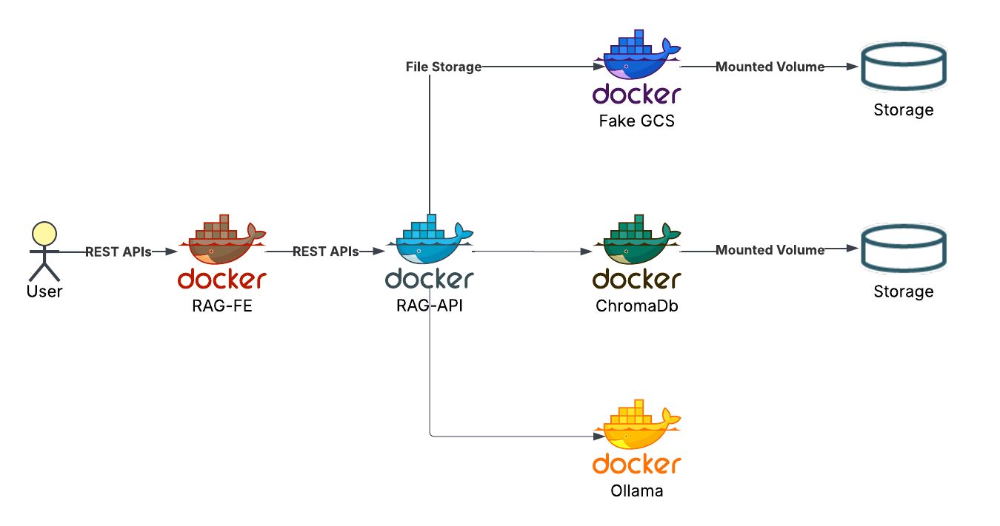
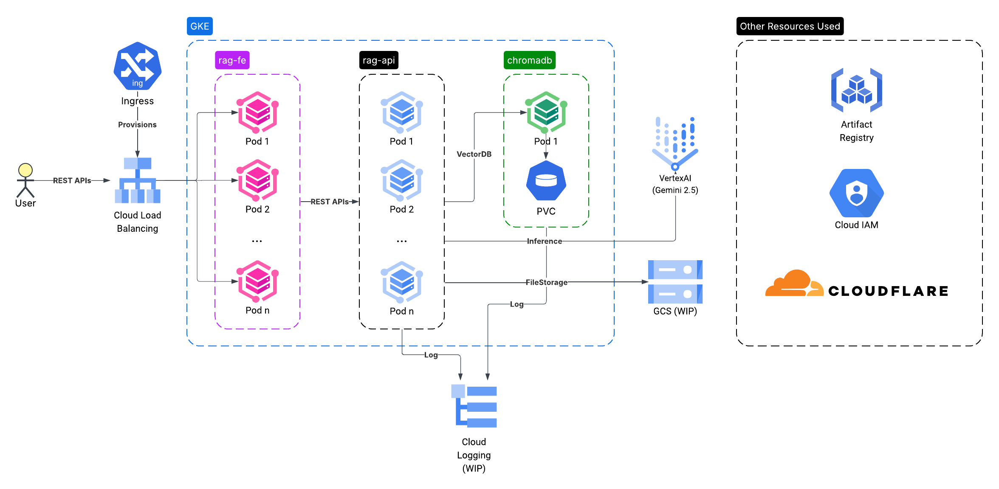

# RAG API

[](https://github.com/tienpdinh/cisc691-a04/actions)
[](https://codecov.io/gh/tienpdinh/cisc691-a04)
[](https://www.python.org/downloads/)

A modern REST API for Retrieval-Augmented Generation powered by LangChain that processes various document types and answers questions using either local LLMs (Ollama) or cloud AI services (Vertex AI). Built with FastAPI for high performance and easy integration.

## 🚀 Deployment Options

### Local Development
- **LLM**: Ollama (privacy-focused, local processing)
- **Setup**: Simple docker compose command
- **Use case**: Development, testing, privacy requirements

### Production (GKE)
- **LLM**: Google Vertex AI (managed, scalable)
- **Setup**: Kubernetes deployment on Google Cloud
- **Use case**: Production workloads, high availability

## Document Processing

The API leverages LangChain for robust document processing:
- **Supported Formats**: PDF, TXT, DOCX (via LangChain document loaders)
- **Processing**: LangChain text splitters with configurable chunking
- **Storage**: Vector embeddings in ChromaDB via LangChain vector stores
- **Retrieval**: Semantic search with LangChain similarity algorithms

## RAG Capabilities

The system implements modern RAG techniques using LangChain:
- **LangChain Integration**: Full RAG pipeline built with LangChain components
- **Contextual Retrieval**: LangChain vector stores find relevant document chunks
- **Knowledge Integration**: LangChain chains combine retrieved context with LLM responses
- **Flexible Models**: Support for both local (Ollama) and cloud (Vertex AI) LLMs via LangChain
- **Citation Support**: Links responses to source documents with metadata

## Architecture

### Local Deployment (Docker)
<div style="background-color: white; padding: 20px;">
    
</div>
<br/>

The local deployment architecture consists of:
- RAG API service container with FastAPI
- ChromaDB container for vector storage
- Redis container for high-performance caching
- Ollama container for LLM inference
- Mounted volumes for persistent storage
- Docker network for container communication

### GCP Deployment
<div style="background-color: white; padding: 20px;">
    
</div>
<br/>

The GCP deployment architecture includes:
- GKE (Google Kubernetes Engine) for container orchestration
- Multiple service instances for scalability
- ChromaDB for vector storage
- Integration with external services and APIs
- Managed persistence and logging

## Features

- **Document Upload**: Supports PDF, DOCX, and TXT formats
- **Semantic Search**: Find documents by content, not just keywords
- **Chunked Retrieval**: Get relevant sections of documents
- **Multi-Language Support**: Query and retrieve documents in various languages
- **Redis Caching**: High-performance caching for faster response times
- **API Key Security**: Protect your API with key-based access
- **Health Check Endpoint**: Monitor API status and uptime

## Prerequisites

**Docker is required** for running this application. Install Docker:

- **Windows/Mac**: Download [Docker Desktop](https://www.docker.com/products/docker-desktop)
- **Linux**: `sudo apt install docker.io docker-compose` (Ubuntu/Debian) or check your distro's package manager

## Quick Start (Local)

**Full containerized setup with Ollama, ChromaDB, and RAG API:**

```bash
# Start all services, this will take a while if you're running this the first time, grab a coffee while you wait
docker compose up -d

# Download the LLM model (first time only)
./scripts/setup-ollama.sh

# API will be available at http://localhost:8001
```

**Service endpoints:**
- RAG API: http://localhost:8001 (with docs at http://localhost:8001/docs)
- ChromaDB: http://localhost:8000
- Redis: http://localhost:6380
- Ollama: http://localhost:11434


### Development Setup

For code development while keeping services containerized:

```bash
# 1. Start only ChromaDB and Ollama
docker-compose up -d chromadb ollama

# 2. Install Python dependencies locally
python -m venv venv
source venv/bin/activate  # or venv\Scripts\activate on Windows
pip install -r requirements.txt

# 3. Configure for local development
cp config.local.json config.json
# Edit config.json: set chromadb_host to "localhost" for local development

# 4. Run API locally for development
python main.py
```

This hybrid approach allows code editing/debugging locally while using containerized services.

## Using the API

### Upload and Process Documents
```bash
# Docker Compose (port 8001)
curl -X POST "http://localhost:8001/upload-document" \
  -F "file=@your-document.pdf"

# Local Python (port 8000)  
curl -X POST "http://localhost:8000/upload-document" \
  -F "file=@your-document.pdf"
```

### Query Documents

The system comes with pre-loaded retail e-commerce sales data covering Q1-Q4 for years 2023-2025. You can ask questions about:

```bash
# Compare quarterly performance
curl -X POST "http://localhost:8001/query" \
  -H "Content-Type: application/json" \
  -d '{"query": "Compare Q4 2023 and Q4 2024 e-commerce performance", "use_rag": true}'

# Ask about specific quarters
curl -X POST "http://localhost:8001/query" \
  -H "Content-Type: application/json" \
  -d '{"query": "What were the key trends in Q3 2024 retail sales?", "use_rag": true}'

# Year-over-year analysis
curl -X POST "http://localhost:8001/query" \
  -H "Content-Type: application/json" \
  -d '{"query": "How did 2024 annual sales compare to 2023?", "use_rag": true}'
```

### Retrieve Relevant Chunks
```bash
# Get relevant document chunks for a query
curl -X POST "http://localhost:8001/retrieve" \
  -H "Content-Type: application/json" \
  -d '{"query": "retail sales performance Q2 2024", "top_k": 3}'
```

### Health Check
```bash
# Check API status (includes cache statistics)
curl "http://localhost:8001/health"
```

## Redis Caching

The API implements intelligent Redis caching to dramatically improve response times for repeated queries. The caching system operates at multiple levels:

- **Query Response Caching**: Complete RAG pipeline responses (15 min TTL)
- **LLM Response Caching**: Expensive LLM API calls (1 hour TTL)
- **Document Retrieval Caching**: Vector search results (30 min TTL)
- **Embedding Caching**: Document embeddings (2 hours TTL)

### Cache Performance Demo

Test the caching system with these commands to see the performance improvement:

```bash
# 1. Clear Redis cache to start fresh
redis-cli -h localhost -p 6380 FLUSHALL

# 2. First query - will be slow (no cache)
time curl -X POST "http://localhost:8001/query" \
  -H "Content-Type: application/json" \
  -d '{"query": "What were the Q1 2024 retail sales trends?", "use_rag": false}'

# 3. Check that cache keys were created
redis-cli -h localhost -p 6380 KEYS "rag:*"

# 4. Same query again - will be much faster (cached)
time curl -X POST "http://localhost:8001/query" \
  -H "Content-Type: application/json" \
  -d '{"query": "What were the Q1 2024 retail sales trends?", "use_rag": false}'

# 5. View cache statistics
curl "http://localhost:8001/health" | jq '.components.cache.stats'
```

**Expected Results:**
- First query: ~2-5 seconds (depending on LLM response time)
- Cached query: ~50-200ms (90%+ faster!)
- Cache hit rate increases with repeated queries

### Cache Monitoring

```bash
# Monitor cache performance
curl "http://localhost:8001/health" | jq '.components.cache'

# View all cached keys
redis-cli -h localhost -p 6380 KEYS "rag:*"

# Check Redis memory usage
redis-cli -h localhost -p 6380 INFO memory | grep used_memory_human

# View cache statistics
redis-cli -h localhost -p 6380 INFO stats | grep keyspace
```

## Performance Benchmarks

The system includes comprehensive performance benchmarking capabilities:

```bash
# Quick benchmark run
python benchmarks/scripts/run_benchmarks.py --url http://localhost:8001 --quick
```

**Current Performance**: ~100ms RAG queries, 70+ req/s throughput, sub-second response times

**Benchmark Types**: Latency, accuracy, quality assessment, and RAG vs baseline comparison

📋 **For detailed benchmark documentation, configuration, and results**: see [`benchmarks/README.md`](benchmarks/README.md)

## API Endpoints

| Method | Endpoint | Description |
|--------|----------|-------------|
| `POST` | `/upload-document` | Upload and process documents (PDF, TXT, DOCX) |
| `POST` | `/query` | Query documents with RAG |
| `POST` | `/retrieve` | Retrieve relevant document chunks |
| `GET` | `/health` | API health check |
| `GET` | `/docs` | Interactive API documentation |

## Production Deployment (GKE)

### Prerequisites
- Google Cloud Project with billing enabled
- GKE cluster
- kubectl configured

### Deploy
```bash
# Build and push Docker image
docker build -t gcr.io/cisc691-a04/rag-api:latest .
docker push gcr.io/cisc691-a04/rag-api:latest

# Set up GCP authentication (see k8s/setup-gcp.md)
# Then deploy
kubectl apply -f k8s/
```

For detailed deployment instructions, see [`k8s/README.md`](k8s/README.md).

## Architecture

This RAG API uses a **microservices architecture** with separate containers for different components:

### Local Development (Docker Compose)
- **RAG API**: FastAPI server handling document processing and queries
- **ChromaDB**: Vector database service for embeddings storage
- **Redis**: High-performance caching layer for query responses
- **Ollama**: Local LLM service with `llama3.1:8b`
- **Communication**: All services communicate via HTTP APIs

### Production (GKE)
- **RAG API**: Load-balanced FastAPI pods with auto-scaling
- **ChromaDB**: Dedicated service with persistent storage
- **Redis**: Distributed caching layer for improved performance
- **Vertex AI**: Google's managed LLM service (`gemini-1.5-flash`)
- **Communication**: Kubernetes service mesh with internal networking

## Configuration

### Local Configuration (`config.local.json`)
- **LLM**: Containerized Ollama service
- **Vector DB**: HTTP connection to ChromaDB service
- **Storage**: Docker volumes for persistence
- **Networking**: Docker Compose internal networking

### Production Configuration (Kubernetes ConfigMap)
- **LLM**: Vertex AI with Workload Identity
- **Vector DB**: HTTP connection to ChromaDB service
- **Storage**: Kubernetes persistent volumes
- **Networking**: Service mesh with load balancing

## Testing & Development

### Run Tests
```bash
pytest --cov=src --cov=. --cov-report=html --cov-report=term-missing
```

### View Coverage Report
```bash
open htmlcov/index.html  # View detailed coverage report
```

## Project Structure

```
├── files/                     # Retail e-commerce sales data (2023-2025, Q1-Q4)
├── src/                       # Source code
│   ├── api_app.py             # FastAPI application setup
│   ├── api_routes.py          # API route definitions
│   ├── api_endpoints.py       # Endpoint business logic
│   ├── api_models.py          # Pydantic request/response models
│   ├── chromadb_retriever.py  # ChromaDB HTTP client
│   ├── embedding_loader.py    # ChromaDB HTTP client for storage
│   └── ...                    # Core RAG modules
├── tests/                     # Unit tests
│   ├── test_api_*.py          # API endpoint tests
│   ├── test_chromadb_*.py     # ChromaDB HTTP client tests
│   └── ...                    # Core module tests
├── k8s/                       # Kubernetes manifests
│   ├── chromadb-*.yaml        # ChromaDB service manifests
│   ├── deployment.yaml        # RAG API deployment
│   └── ...                    # Other K8s resources
├── data/                      # Data directories (Docker volumes)
├── docker-compose.yml         # Local development setup
├── config.local.json          # Local development config
├── main.py                    # API server entry point
└── Dockerfile                 # RAG API container image
```

## Troubleshooting

### Docker Compose Issues
- **Services won't start**: Run `docker-compose logs` to check errors
- **Model not found**: Run `./scripts/setup-ollama.sh` to download models
- **Port conflicts**: Change ports in `docker-compose.yml` if needed
- **Storage issues**: Run `docker compose down -v` to reset volumes

### Local Python Issues  
- **API won't start**: Make sure `ollama` container is running first
- **Upload failures**: Check file types (PDF, TXT, DOCX only)
- **Query returns empty**: Upload documents first via `/upload-document`
- **CUDA errors**: Install CUDA drivers for GPU support

### GKE Issues
- **Authentication**: Verify service account setup
- **Pod failures**: Check `kubectl logs` and resource limits
- **Vertex AI errors**: Ensure APIs are enabled and billing is active
- **API timeout**: Check load balancer and service configuration

## Contributing

1. Run tests: `pytest`
2. Check coverage: Coverage reports available in CI
3. Follow code style: Automated linting in CI